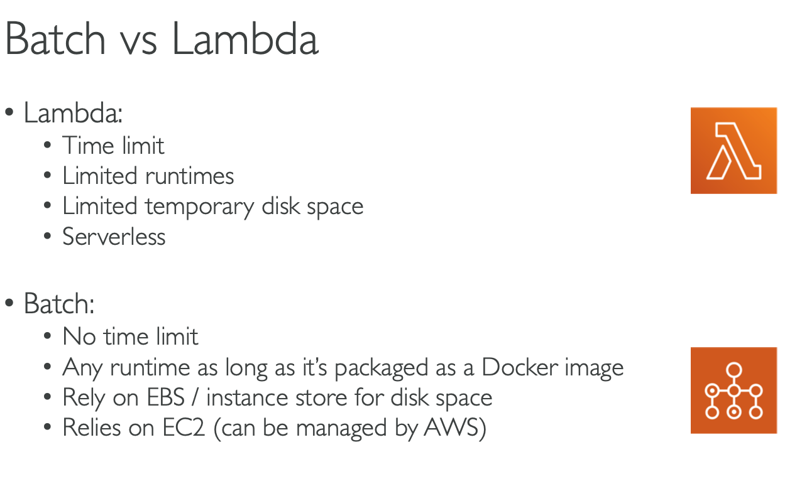
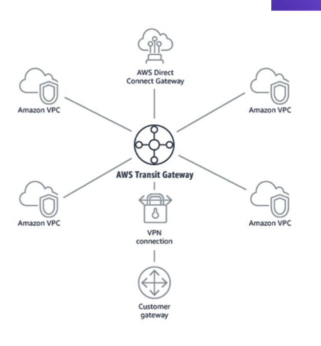

- Amazon Augmented AI: provides built-in human review workflows for common machine learning use cases, such as content moderation and text extraction from documents. With Amazon A2I, you can also create your own workflows for machine learning models built on Amazon SageMaker or any other tools

- Amazon Textract is a machine learning service that automatically extracts text and data from scanned documents

- Amazon Lex is a service that enables you to build conversational interfaces using voice and text.

- Review how much cost your predicted AWS usage will incur by the end of the month - You can perform this action in AWS Budgets.

- Create an estimate for the cost of your use cases on AWS - You can perform this action in AWS Pricing Calculator.

- Visualize and manage your AWS costs and usage over time - You can perform this action in AWS Cost Explorer.

- Customers should be aware that their responsibilities may vary depending on the AWS services chosen.  For example, when using Amazon EC2, you are responsible for applying operating system and application security patches regularly. However, such patches are applied automatically when using Amazon RDS.

-  AWS Global Accelerator and CloudFront are two separate services that use the AWS global network and its edge locations around the world. Amazon CloudFront improves performance for global applications by caching content at the closest Edge Location to end-users. AWS Global Accelerator improves performance for global applications by routing end-user requests to the closest AWS Region

- Amazon EBS is not a cost-effective solution for storing images or videos (compared to Amazon S3). Amazon EBS is a block level storage that can be used as a disk drive for Amazon EC2 or Amazon RDS instances. Amazon EBS is designed for application workloads that benefit from fine tuning for performance and capacity. Typical use cases of Amazon EBS include Big Data analytics engines (like the Hadoop/HDFS ecosystem and Amazon EMR clusters), relational and NoSQL databases (like Microsoft SQL Server and MySQL or Cassandra and MongoDB), stream and log processing applications (like Kafka and Splunk), and data warehousing applications (like Vertica and Teradata).

- Amazon S3 is object storage built to store and retrieve any amount of data from anywhere on the Internet. It is a storage service that offers an extremely durable, highly available, and infinitely scalable data storage infrastructure at very low costs.

    - Common use cases of Amazon S3 include:

    ** Media Hosting – Build a redundant, scalable, and highly available infrastructure that hosts video, photo, or music uploads and downloads.

    ** Backup and Storage – Provide data backup and storage services for others.

    ** Hosting static websites – Host and manage static websites quickly and easily.

    ** Deliver content globally - Use S3 in conjunction with CloudFront to distribute content globally with low latency.

    ** Hybrid cloud storage - Create a seamless connection between on-premises applications and Amazon S3 with AWS Storage Gateway in order to reduce your data center footprint, and leverage the scale, reliability, and durability of AWS.

- Savings Plans are a flexible pricing model that offers low prices on EC2, Lambda, and Fargate usage, in exchange for a commitment to a consistent amount of usage (measured in $/hour) for a 1 or 3 year term. When you sign up for Savings Plans, you will be charged the discounted Savings Plans price for your usage up to your commitment. For example, if you commit to $10 of compute usage an hour, you will get the Savings Plans prices on that usage up to $10 and any usage beyond the commitment will be charged On Demand rates

- Currently, Amazon Redshift only supports Single-AZ deployments.

- Amazon EBS volume data is replicated across multiple servers within the same Availability Zone.

- Data protection refers to protecting data while in-transit (as it travels to and from Amazon S3) and at rest (while it is stored on disks in AWS data centers). The AWS customer is responsible for protecting their data either at rest or in transit for all services (including S3).

- Pricing is per instance-hour consumed for each instance, from the time an instance is launched until it is terminated or stopped. Each partial instance-hour consumed will be billed per-second (minimum of 1 minute) for Linux or Ubuntu Instances and as a full hour for all other instance types.

    ** Examples for Linux\Ubuntu based instances:

        1- If you run a Linux instance for 4 seconds or 20 seconds or 59 seconds, you will be charged for one minute. (this is what we mean by minimum of 1 minute)

        2- If you run a Linux instance for 1 minute and 3 seconds, you will be charged for 1 minute and 3 seconds.

        3- If you run a Linux instance for 3 hours, 25 minutes and 7 seconds, you will be charged for 3 hours, 25 minutes and 7 seconds.

    ** Examples for non-Linux\Ubuntu instances:

        1- If you run an instance for 4 seconds or 20 seconds or 59 seconds, you will be charged for one hour.

        2- If you run an instance for 1 minute and 3 seconds, you will be charged for one hour.

        3- If you run an instance for 3 hours, 25 minutes and 7 seconds, you will be charged for 4 hours.

- Platform as a Service (PaaS) removes the need for your organization to manage the underlying infrastructure (usually hardware and operating systems) and allows you to focus on the deployment and management of your applications. This helps you be more efficient as you don’t need to worry about resource procurement, capacity planning, software maintenance, patching, or any of the other undifferentiated heavy lifting involved in running your application. A common example of a PaaS platform is the AWS Elastic Beanstalk service. Developers simply upload their application, and Elastic Beanstalk automatically handles the deployment details of capacity provisioning, load balancing, auto-scaling, and application health monitoring.

- With the multi-region Active-Active solution, your workload is deployed to, and actively serving traffic from, multiple AWS Regions. If an entire Region goes down because of a natural disaster or any other reason, the other Regions will still be available and able to serve user requests.

- AWS Config and AWS CloudTrail are change management tools that help AWS customers audit and monitor all resource and configuration changes in their AWS environment

    ** Customers can use AWS Config to answer “What did my AWS resource look like?” at a point in time. Customers can use AWS CloudTrail to answer “Who made an API call to modify this resource?”

- AWS Storage Gateway is a hybrid cloud storage service that gives you on-premises access to virtually unlimited cloud storage.

- Snowball Edge is best-suited to move petabytes of data and offers computing capabilities. Be careful, it's recommended to use a fleet of Snowballs to move less than 10PBs of data. Over this quantity, it's better-suited to use Snowmobile.

- Snowball Edge Storage Optimized devices are well suited for large-scale data migrations and recurring transfer workflows, as well as local computing with higher capacity needs.

- S3 Glacier Vault Lock allows you to easily deploy and enforce compliance controls for individual S3 Glacier vaults with a vault lock policy. You can specify controls such as “write once read many” (WORM) in a vault lock policy and lock the policy from future edits. Once locked, the policy can no longer be changed.

- AWS Personal Health Dashboard provides alerts and remediation guidance when AWS is experiencing events that may impact you.

- Penetration Testing is allowed without prior approval on 8 services. DDoS, port flooding and protocol flooding are examples of prohibited activities.

- AWS is responsible for patching and fixing flaws within the infrastructure, but customers are responsible for patching their guest OS and applications. Shared Controls also includes Configuration Management, and Awareness and Training.

- Amazon GuardDuty is a threat detection service that continuously monitors for malicious activity and unauthorized behavior to protect your AWS accounts and workloads.

- Amazon Lex is a service for building conversational interfaces into any application using voice and text. Lex provides the advanced deep learning functionalities of automatic speech recognition (ASR) for converting speech to text, and natural language understanding (NLU) to recognize the intent of the text, to enable you to build applications with highly engaging user experiences and lifelike conversational interactions.

- IAM roles are meant to be used by AWS services themselves.

- Convertible Reserved Instance can save you up to 45% discount.

- Scheduled Reserved Instance's commitment is 1 year only.

- Spot instances can save you up to 90%.

- EC2 Dedicated Hosts: compliance requirements, use your existing server-bound software licenses.

- EC2 Dedicated instances: running on hardware that is dedicated to you, may share hardware with other instances in same account, no control over instance placement.

- EBS they can only be mounted to one instance at a time (at the CCP level), 1 availability zone (like a network usb stick). capacity must be provisioned.

- EBS snapshot can be copied accross AZ or region.

- If you need a high performance EC2 hardware disk, use EC2 instance store.

- EFS works with EC2 instances in multi-AZ.

- EFS IA - save up to 95% cost, enable EC2-IA with life cycle policy.

- Elasticity: some "auto-scaling" so that the file system can scale based on the load.

- Agility: IT resources are only 1 click away.

- S3 : infinite scaling storage

- S3 looks like a global service but buckets are created in a region.

- S3 max object's size: 5TB

- File upload more than 5GB, must use "multi-part upload"

- S3 Object Lock & Glacier Vault lock
    ** Adopt a WORM (write once read many) model
    ** Object lock: block an object version deletion for a specified amount of time
    ** Glacier vault lock: lock the policy for future edit. (object cant be deleted)

- S3 is a proprietary technology of AWS

## Services managed by AWS
- For managed services such as Amazon Elastic MapReduce (Amazon EMR) and DynamoDB, AWS is responsible for performing all the operations needed to keep the service running.

- Amazon EMR launches clusters in minutes. You don’t need to worry about node provisioning, infrastructure setup, Hadoop configuration, or cluster tuning. Amazon EMR takes care of these tasks so you can focus on analysis.

- DynamoDB is serverless with no servers to provision, patch, or manage and no software to install, maintain, or operate. DynamoDB automatically scales tables up and down to adjust for capacity and maintain performance. Availability and fault tolerance are built in, eliminating the need to architect your applications for these capabilities.

- Other managed services include: AWS Lambda, Amazon RDS, Amazon Redshift, Amazon CloudFront, and several other services.

## The AWS managed services
- AMS is an AWS service that operates AWS on behalf of enterprise customers and partners. Enterprises want to adopt AWS at scale but often the skills that have served them well in traditional IT do not always translate to success in the cloud. AWS Managed Services (AMS) enables them to migrate to AWS at scale more quickly, reduce their operating costs, improve security and compliance and focus on their differentiating business priorities.

## Amazon Elastic Container Registry (ECR) 
- is a Docker container registry that allows developers to store, manage, and deploy Docker container images.

## Amazon Athena 
- is an interactive query service that is mainly used to analyze data in Amazon S3 using standard SQL.

## AWS Personal Health Dashboard 
- provides alerts and remediation guidance when AWS is experiencing events that may impact you. 
- The benefits of the AWS personal health dashboard include:

    ** A personalized View of Service Health
    ** Proactive Notifications
    ** Detailed Troubleshooting Guidance

## The AWS Abuse team 
- can assist you when AWS resources are being used to engage in the following types of abusive behavior:    
    ** spam
    ** port scanning
    ** DOS 
    ** Intrusion attempts
    ** Hosting objectionable or copyrighted content
    ** Distributing malware

## AWS Infrastructure Event Management 
- is a short-term engagement with AWS Support, included in the Enterprise-level Support product offering, and available for additional purchase for Business-level Support subscribers. AWS Infrastructure Event Management partners with your technical and project resources to gain a deep understanding of your use case and provide architectural and scaling guidance for an event. Common use-case examples for AWS Event Management include advertising launches, new product launches, and infrastructure migrations to AWS.

## The AWS Cost & Usage Report 
- is your one-stop shop for accessing the most detailed information available about your AWS costs and usage.The AWS Cost & Usage Report lists AWS usage for each service category used by an account and its IAM users in hourly or daily line items, as well as any tags that you have activated for cost allocation purposes.

## AWS Quick Start Reference Deployments
- outline the architectures for popular enterprise solutions on AWS and provide AWS CloudFormation templates to automate their deployment

## AWS OpsWorks 
- is a configuration management service that provides managed instances of Chef and Puppet. Chef and Puppet are automation platforms that allow you to use code to automate the configurations of your servers.

## Amazon Kinesis Video Streams 
- enables you to securely stream video from connected devices (IoT devices) to AWS for analytics, machine learning (ML), playback, and other processing. Kinesis Video Streams automatically provisions and elastically scales all the infrastructure needed to ingest streaming video data from millions of devices. It durably stores, encrypts, and indexes video data in your streams, and allows you to access your data through easy-to-use APIs.

## Shared Controls 
are controls which apply to both the infrastructure layer and customer layers, but in completely separate contexts or perspectives. In a shared control, AWS provides the requirements for the infrastructure and the customer must provide their own control implementation within their use of AWS services.

Examples include:

** Patch Management – AWS is responsible for patching the underlying hosts and fixing flaws within the infrastructure, but customers are responsible for patching their guest OS and applications.

** Configuration Management – AWS maintains the configuration of its infrastructure devices, but a customer is responsible for configuring their own guest operating systems, databases, and applications.

** Awareness & Training - AWS trains AWS employees, but a customer must train their own employees.

## Network Load Balancer
-  is best suited for load balancing of TCP and TLS traffic.

##  AWS X-Ray 
- helps developers analyze and debug distributed applications in production or under development, such as those built using microservice architecture. With X-Ray, you can understand how your application and its underlying services are performing so you can identify and troubleshoot the root cause of performance issues and errors. X-Ray provides an end-to-end view of requests as they travel through your application, and shows a map of your application’s underlying components. You can use X-Ray to analyze both applications in development and in production, from simple three-tier applications to complex microservices applications consisting of thousands of services. 

## Amazon Machine Image (AMI) 
- is a template that contains a software configuration (for example, an operating system, an application server, and applications). This pre-configured template save time and avoid errors when configuring settings to create new instances. You specify an AMI when you launch an instance, and you can launch as many instances from the AMI as you need. You can also launch instances from as many different AMIs as you need.

## Amazon EMR (Elastic mapreduce)
- helps you analyze and process vast amounts of data by distributing the computational work across a cluster of virtual servers running in the AWS Cloud. The cluster is managed using an open-source framework called Hadoop. Amazon EMR lets you focus on crunching or analyzing your data without having to worry about time-consuming setup, management, and tuning of Hadoop clusters or the compute capacity they rely on.

## Amazon S3 Transfer Acceleration 
- enables fast, easy, and secure transfers of files over long distances between your client and an S3 bucket. Transfer Acceleration takes advantage of Amazon CloudFront’s globally distributed edge locations. As the data arrives at an edge location, data is routed to Amazon S3 over an optimized network path.

## EC2 Instance Connect
- works only out of the box with EC2 Linux
- Connect to your instances within your browser.

## AMI (Amazon Machine Image)
- customization of an EC2 instance
- built for a specific region
- you can launch your EC2 instances from a : public, your own, or AWS marketplace AMI.

## Amazon FSx for windows file server
- fully managed windows native shared file system.
- built on windows file server.
- support SMB protocol & windows NTFS.

## Amazon FSx for Lustre
- fully managed file storage for HPC (High Performance Computing): machine learning, analytics, video processing, financial modeling.
- high performance computing linux file system

## Amazon ELB (Elastic Load Balancer)
- fully managed load balancer.
- 3 types of load balancer:
    ** Application Load Balancer (HTTP/HTTPS only) - layer 7
    ** Network Load Balancer (ultra-high performance, allows for TCP) - Layer 4
    ** Classic Load Balancer (retiring) - Layer 4 & 7

## Auto Scaling Group
- Manual Scaling
- Dynamic Scaling:
    ** Simple / Step scaling : Cloudwatch Alarm trigger (CPU > 70%), add 2 units
    ** Target Tracking scaling: average CPU usage around 50%
    ** Scheduled scaling: anticipate usage pattern
    ** Predictive scaling: maching learning to predict future traffic ahead of time.

## AWS OpsHub
- previously, to use Snow family device you needed a CLI.
- now, you can use OpsHub to manage your snow family devices.

## AWS Storage Gateway
- Allow on-premises to seamlessly use AWS cloud
- Type of storage gateway:
    ** file gateway
    ** volume gateway
    ** tape gateway

## ECS Elastic Container Service
- You must provision and maintain the infrastructure (the EC2 instance).
- AWS taking care of starting/stopping containers.

## Fargate
- Like ECS, but you do not need to provision the infrastructure (no EC2 instances to manage).
- Serverless offering.

## ECR (Elastic Container Registry)
- Private docker registry on AWS.
- Store your docker images.

## Amazon API Gateway
- serverless, fully managed service for developers to easily create, publish, maintain, monitor and secure APIs.
- support Restful and Websocket APIs.

## AWS Batch
- fully managed batch processing at any scale.
- batch will dynamically launch EC2 instance of spots
- no time limit

Batch vs lambda:

## AWS Lightsail
- Greate for people with little cloud experience
- Virtual servers, storage, databases, and networking.
- simpler alternative using EC2, RDS, ELB, EBS, Route 53, ..
- predictable and low pricing for simple application & DB stacks.

## AWS Cloud Development Kit (CDK)
- Define your cloud infrastructure using common programming languages.
- The code is "compiled" into CloudFormation template.

## AWS Elastic Beanstalk
- Developer centric for deploying application
- Beanstalk is free but you pay for the underlying instances.
- 3 architecure models:
    ** single instance
    ** ELB + ASG
    ** ASG only

## AWS CodeDeploy
- we want to deploy our application automatically onto the cloud
- hybrid service.

## AWS CodeCommit
- code repo in AWS

## AWS CodeBuild
- test and build code in CodeCommit to packages that are ready to be deployed.

## AWS CodePipeline
- Orchestrade CodeCommit -> CodeBuild -> CodeDeploy -> ElasticBeanstalk.

## AWS CodeArtifact
- Developers and CodeBuild can then retrieve dependencies straight from CodeArtifact.

## AWS CodeStar
- Unified UI for CodeCommit, CodePipeline, CodeBuild, CodeDeploy, CodeArtifact, Elastic Beanstalk, ...

## AWS Cloud 9 
- Cloud IDE (runs in browser)

## AWS System Manager
- manage your EC2 and On-Premises system at scale.
- Hybrid AWS service
- important features:
    ** patching automation for enhanced compliance
    ** run commands across an entire fleet of servers.
- we need to install the SSM agent onto the systems we control

## AWS OpsWorks
- Chef && Puppet help you perform server configuration automatically

## Amazon kinesis
- For the exam, Kinesis = realtime big data streaming
- Managed service to collect, process, and analyze data real-time streaming data at any scale.

## Amazon MQ
- It is managed Apache ActiveMQ
- suitable for old application running protocol like: MQTT, AMQP, STOMP,...
- when we don't want to re-engineer the application to use SQS, SNS, we can use Amazon MQ

## Cloudwatch logs
- get log from multiple sources: Elastic Beanstalk, EC2, ECS, 
- by default, no logs from your EC2 instance will go to CloudWatch, you need to run CloudWatch agent on EC2 to push the log files you want.
- The CloudWatch agent can be setup on-premises too

## Amazon CloudWatch Events / EventBridge
- EventBridge is the next evolution of CloudWatch Events

## AWS CloudTrail
- Provides governance, compliance and audit for your AWS Account.
- enable CloudTrail Insights to detect unusual activities in your account
- CloudTrail events are stored for 90 days
- To keep events beyond this period, log them to S3 and use Athena.
- There are 3 types of event:
    ** Management events
    ** data events
    ** insight events

## Anazon CodeGuru
- ML-powered service for automated code reviews and application performance recommendations
    ** CodeGuru Reviewer: automated code reviews for static code analysis
    ** CodeGuru Profiler: visibility/recommendations about application performance during runtime.

## Service Health Dashboard
- all services status

## Personal Health Dashboard
- alerts and remediation guidance
- personalized view into the performance and availability of the AWS services uderlying your AWS resources.

## VPC
- NAT Gateways & NAT Instances allow your instances in your Private Subnets to access the internet while remaining private
- VPC Flow Logs: network logs, help to monitor & troubleshoot connectivity issues.
- VPC Peering: connect two VPC, privately using AWS's network (make them behave as if they were in the same network)
- VPC Endpoints allow you to connect to AWS services using a private network instead of public www network.
    ** VPC Endpoint Gateway: S3 & DynamoDB
    ** VPC Endpoint interface: the rest

## Transit Gateway
- Network topology can be very complicated, 
- For having transitive peering between thousands of VPC and on-premises

