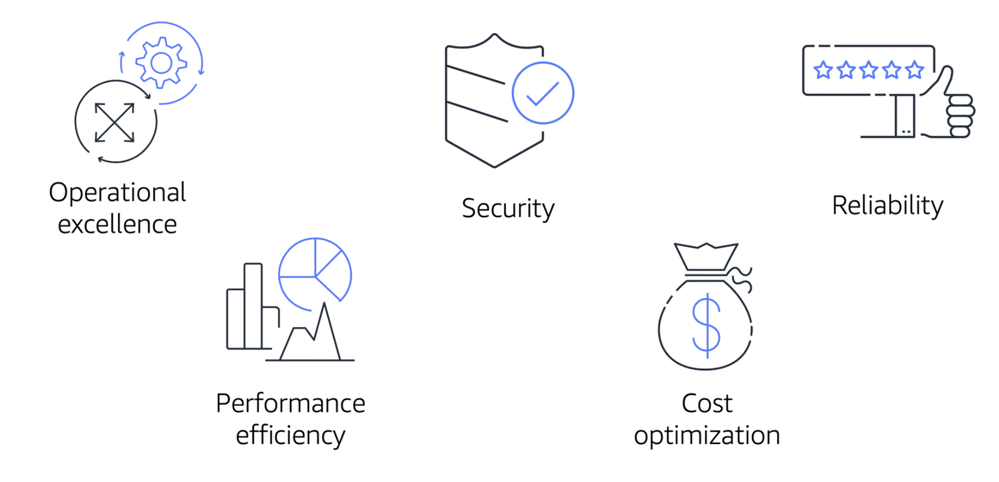

## The AWS Well-Architected Framework

- The AWS Well-Architected Framework helps you understand how to design and operate reliable, secure, efficient, and cost-effective systems in the AWS Cloud. It provides a way for you to consistently measure your architecture against best practices and design principles and identify areas for improvement.

The Well-Architected Framework is based on five pillars: 

- Operational excellence:
* Operational excellence is the ability to run and monitor systems to deliver business value and to continually improve supporting processes and procedures.  

- Security
* The Security pillar is the ability to protect information, systems, and assets while delivering business value through risk assessments and mitigation strategies. 

* When considering the security of your architecture, apply these best practices:

    ** Automate security best practices when possible.
    ** Apply security at all layers.
    ** Protect data in transit and at rest.

- Reliability
* Reliability is the ability of a system to do the following:

    ** Recover from infrastructure or service disruptions
    ** Dynamically acquire computing resources to meet demand
    ** Mitigate disruptions such as misconfigurations or transient network issues

- Performance efficiency
* Performance efficiency is the ability to use computing resources efficiently to meet system requirements and to maintain that efficiency as demand changes and technologies evolve. 

- Cost optimization
* Cost optimization is the ability to run systems to deliver business value at the lowest price point. 

## Advantages of cloud computing

Operating in the AWS Cloud offers many benefits over computing in on-premises or hybrid environments. 
six advantages of cloud computing:

- Trade upfront expense for variable expense.

- Benefit from massive economies of scale.

- Stop guessing capacity.

- Increase speed and agility.

- Stop spending money running and maintaining data centers.

- Go global in minutes.
