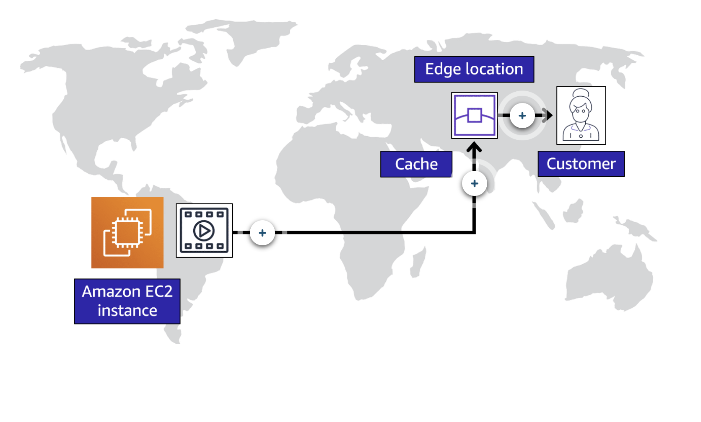

## Selecting a Region

When determining the right Region for your services, data, and applications, consider the following four business factors. 

- Compliance with data governance and legal requirements:
* Depending on your company and location, you might need to run your data out of specific areas. For example, if your company requires all of its data to reside within the boundaries of the UK, you would choose the London Region. 

- Proximity to your customers: 
* Selecting a Region that is close to your customers will help you to get content to them faster. For example, your company is based in Washington, DC, and many of your customers live in Singapore. You might consider running your infrastructure in the Northern Virginia Region to be close to company headquarters, and run your applications from the Singapore Region.

- Available services within a Region: 
* Sometimes, the closest Region might not have all the features that you want to offer to customers. AWS is frequently innovating by creating new services and expanding on features within existing services. However, making new services available around the world sometimes requires AWS to build out physical hardware one Region at a time. 

- Pricing
* Suppose that you are considering running applications in both the United States and Brazil. The way Brazil’s tax structure is set up, it might cost 50% more to run the same workload out of the São Paulo Region compared to the Oregon Region. You will learn in more detail that several factors determine pricing, but for now know that the cost of services can vary from Region to Region.

## Availability Zones

- An Availability Zone is a single data center or a group of data centers within a Region. Availability Zones are located tens of miles apart from each other. This is close enough to have low latency (the time between when content requested and received) between Availability Zones. However, if a disaster occurs in one part of the Region, they are distant enough to reduce the chance that multiple Availability Zones are affected.

- A best practice is to run applications across at least two Availability Zones in a Region.

## Amazon Cloudfront

- An edge location is a site that Amazon CloudFront uses to store cached copies of your content closer to your customers for faster delivery.

- When the customers request files, Amazon Cloudfront retrieves the files from the cache in the edge location and delivers the files to the customers. 

.jpg[]

## Ways to interact with AWS services

- AWS management console:
* The AWS Management Console is a web-based interface for accessing and managing AWS services. You can quickly access recently used services and search for other services by name, keyword, or acronym. The console includes wizards and automated workflows that can simplify the process of completing tasks.

* You can also use the AWS Console mobile application to perform tasks such as monitoring resources, viewing alarms, and accessing billing information. Multiple identities can stay logged into the AWS Console mobile app at the same time.

- AWS CLI:
* To save time when making API requests, you can use the AWS Command Line Interface (AWS CLI). AWS CLI enables you to control multiple AWS services directly from the command line within one tool. AWS CLI is available for users on Windows, macOS, and Linux. 

* By using AWS CLI, you can automate the actions that your services and applications perform through scripts. For example, you can use commands to launch an Amazon EC2 instance, connect an Amazon EC2 instance to a specific Auto Scaling group, and more.

- AWS SDK:
* Another option for accessing and managing AWS services is the software development kits (SDKs). SDKs make it easier for you to use AWS services through an API designed for your programming language or platform. SDKs enable you to use AWS services with your existing applications or create entirely new applications that will run on AWS.

## AWS Elastic Beanstalk

With AWS Elastic Beanstalk, you provide code and configuration settings, and Elastic Beanstalk deploys the resources necessary to perform the following tasks:

- Adjust capacity
- Load balancing
- Automatic scaling
- Application health monitoring

## AWS CloudFormation

AWS CloudFormation

With AWS CloudFormation, you can treat your infrastructure as code. This means that you can build an environment by writing lines of code instead of using the AWS Management Console to individually provision resources.

AWS CloudFormation provisions your resources in a safe, repeatable manner, enabling you to frequently build your infrastructure and applications without having to perform manual actions. It determines the right operations to perform when managing your stack and rolls back changes automatically if it detects errors.

## AWS Outposts
- Run AWS services right in your data center.
- AWS Outposts is a service that enables you to run infrastructure in a hybrid cloud approach.
- AWS Outposts are server racks that placed inside your data center.

## AWS WaveLength
- Bring AWS Services to the edge of 5GB network
- in the exam, WaveLength = 5GB network
