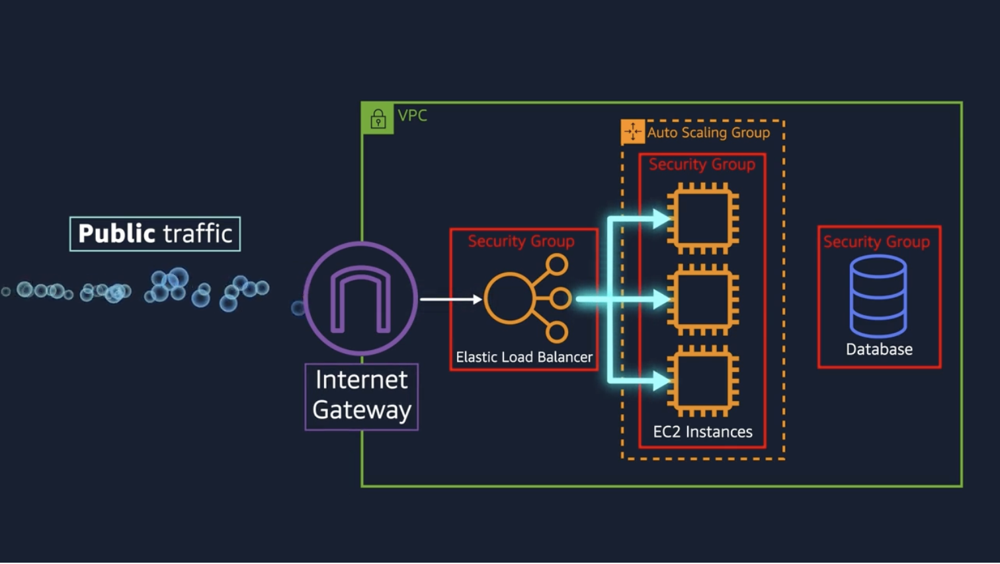
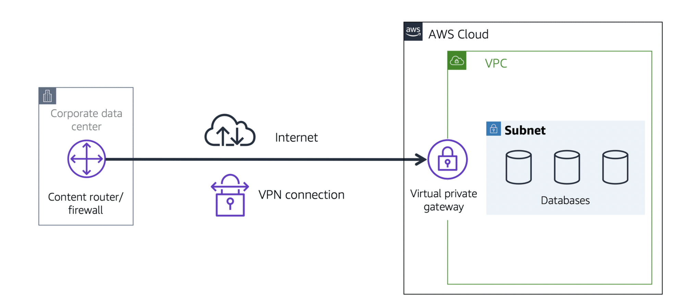
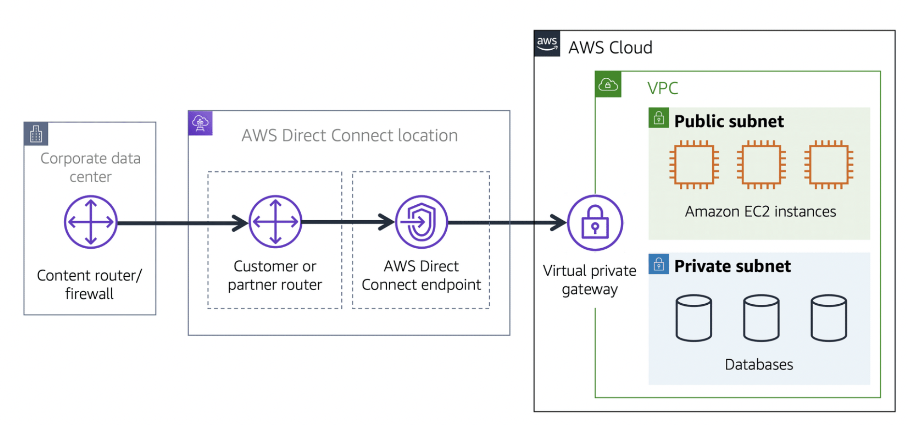
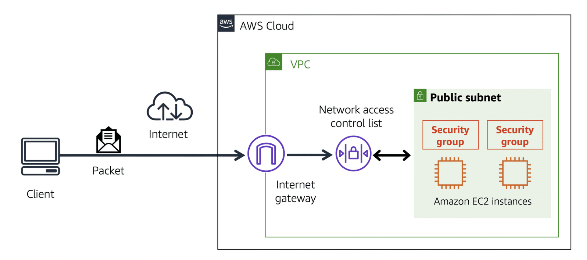

## Amazon VPC (Virtual Private Cloud)

- A networking service that you can use to establish boundaries around your AWS resources is Amazon Virtual Private Cloud (Amazon VPC).

- A VPC lets you provision a logically isolated section of the AWS Cloud where you can launch AWS resources in a virtual network that you define

- These resources can be public facing so they have access to the internet, or private with no internet access, usually for backend services like databases or application servers. The public and private grouping of resources are known as subnets and they are ranges of IP addresses in your VPC. 

- private subnet & public subnet

- Within a virtual private cloud (VPC), you can organize your resources into subnets. A subnet is a section of a VPC that can contain resources such as Amazon EC2 instances.

### Internet gateway

.jpg[]

### Virtual private gateway

To access private resources in a VPC, you can use a virtual private gateway. 

The virtual private gateway is the component that allows protected internet traffic to enter into the VPC

.jpg[]

A virtual private gateway enables you to establish a virtual private network (VPN) connection between your VPC and a private network, such as an on-premises data center or internal corporate network. A virtual private gateway allows traffic into the VPC only if it is coming from an approved network.

### AWS Direct Connect

- *AWS Direct Connect* is a service that enables you to establish a dedicated private connection between your data center and a VPC.  

.jpg[]

## Network traffic in a VPC

When a customer requests data from an application hosted in the AWS Cloud, this request is sent as a packet. A packet is a unit of data sent over the internet or a network. 

It enters into a VPC through an internet gateway. Before a packet can enter into a subnet or exit from a subnet, it checks for permissions. These permissions indicate who sent the packet and how the packet is trying to communicate with the resources in a subnet.

The VPC component that checks packet permissions for subnets is a network access control list (ACL).

### Network access control lists (ACLs)

A *network access control list* (ACL) is a virtual firewall that controls inbound and outbound traffic at the subnet level.

Each AWS account includes a default network ACL. When configuring your VPC, you can use your account’s default network ACL or create custom network ACLs. 

By default, your account’s default network ACL allows all inbound and outbound traffic, but you can modify it by adding your own rules. For custom network ACLs, all inbound and outbound traffic is denied until you add rules to specify which traffic to allow. Additionally, all network ACLs have an explicit deny rule. This rule ensures that if a packet doesn’t match any of the other rules on the list, the packet is denied. 

### Stateless packet filtering

Network ACLs perform stateless packet filtering. They remember nothing and check packets that cross the subnet border each way: inbound and outbound. 

### Security groups

A *security group* is a virtual firewall that controls inbound and outbound traffic for an Amazon EC2 instance.

By default, a security group denies all inbound traffic and allows all outbound traffic. You can add custom rules to configure which traffic to allow or deny.

When a packet response for that request returns to the instance, the security group remembers your previous request. The security group allows the response to proceed, regardless of inbound security group rules.

.jpg[]

## Amazon Route 53

Amazon Route 53 is a DNS web service. It gives developers and businesses a reliable way to route end users to internet applications hosted in AWS. 

Amazon Route 53 connects user requests to infrastructure running in AWS (such as Amazon EC2 instances and load balancers). It can route users to infrastructure outside of AWS.

Another feature of Route 53 is the ability to manage the DNS records for domain names. You can register new domain names directly in Route 53. You can also transfer DNS records for existing domain names managed by other domain registrars. This enables you to manage all of your domain names within a single location.