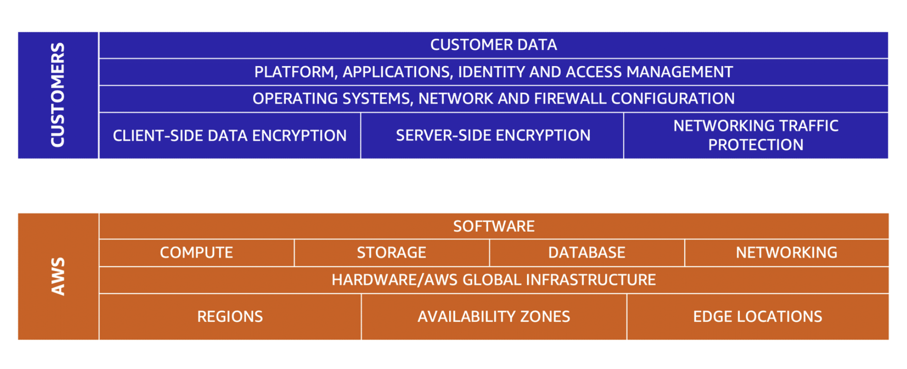
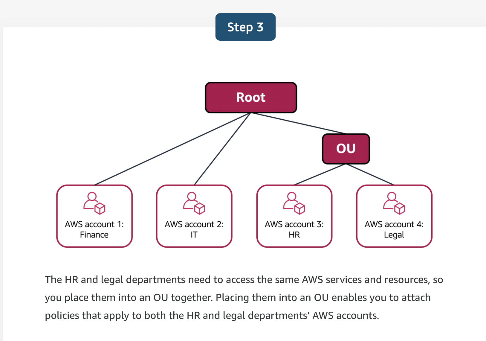

## The AWS shared responsibility model

- Both AWS and the customer are responsible for keeping the AWS resources secure.

- The reason is that you do not treat your AWS environment as a single object. Rather, you treat the environment as a collection of parts that build upon each other. AWS is responsible for some parts of your environment and you (the customer) are responsible for other parts. This concept is known as the shared responsibility model.

- The shared responsibility module divides into customer responsibilities (security in the cloud) and AWS responsibilities (security of the cloud).

- AWS is responsible for protecting the global infrastructure that runs all of the services offered in the AWS Cloud. This infrastructure includes AWS Regions, Availability Zones, and edge locations.

## AWS Identity and Access Management (IAM)

- AWS Identity and Access Management (IAM) enables you to manage access to AWS services and resources securely.   

- IAM gives you the flexibility to configure access based on your company’s specific operational and security needs. You do this by using a combination of IAM features:
    * IAM users, groups, and roles
    * IAM policies
    * Multi-factor authentication

### AWS account root user
- When you first create an AWS account, you begin with an identity known as the root user. 

The root user is accessed by signing in with the email address and password that you used to create your AWS account.

- Best practice: 
    * Do not use the root user for everyday tasks. 

    * Instead, use the root user to create your first IAM user and assign it permissions to create other users.

    * Then, continue to create other IAM users, and access those identities for performing regular tasks throughout AWS. Only use the root user when you need to perform a limited number of tasks that are only available to the root user. Examples of these tasks include changing your root user email address and changing your AWS support plan.

### IAM users
- An IAM user is an identity that you create in AWS. It represents the person or application that interacts with AWS services and resources. It consists of a name and credentials.

- By default, when you create a new IAM user in AWS, it has no permissions associated with it

- Best practice:

    * We recommend that you create individual IAM users for each person who needs to access AWS.  

    * Even if you have multiple employees who require the same level of access, you should create individual IAM users for each of them. This provides additional security by allowing each IAM user to have a unique set of security credentials.

### IAM policies

- An IAM policy is a document that allows or denies permissions to AWS services and resources.  

- IAM policies enable you to customize users’ levels of access to resources. For example, you can allow users to access all of the Amazon S3 buckets within your AWS account, or only a specific bucket.

### IAM groups

- An IAM group is a collection of IAM users. When you assign an IAM policy to a group, all users in the group are granted permissions specified by the policy.

### IAM roles

- In the coffee shop, an employee rotates to different workstations throughout the day. Depending on the staffing of the coffee shop, this employee might perform several duties: work at the cash register, update the inventory system, process online orders, and so on. 

- When the employee needs to switch to a different task, they give up their access to one workstation and gain access to the next workstation. The employee can easily switch between workstations, but at any given point in time, they can have access to only a single workstation. This same concept exists in AWS with IAM roles.

- An IAM role is an identity that you can assume to gain temporary access to permissions.  

- Before an IAM user, application, or service can assume an IAM role, they must be granted permissions to switch to the role. When someone assumes an IAM role, they abandon all previous permissions that they had under a previous role and assume the permissions of the new role. 

- IAM roles are ideal for situations in which access to services or resources needs to be granted temporarily, instead of long-term.  

- You can enable MFA for the root user and IAM users. As a best practice, enable MFA for the root user and all IAM users in your account. By doing this, you can keep your AWS account safe from unauthorized access.

## AWS Organizations

- Suppose that your company has multiple AWS accounts. You can use AWS Organizations to consolidate and manage multiple AWS accounts within a central location.

- When you create an organization, AWS Organizations automatically creates a root, which is the parent container for all the accounts in your organization.

- In AWS Organizations, you can centrally control permissions for the accounts in your organization by using service control policies (SCPs). SCPs enable you to place restrictions on the AWS services, resources, and individual API actions that users and roles in each account can access.

- SCPs can be applied to:
    * An individual member account
    * An organizational unit (OU)

- An SCP affects all IAM users, groups, and roles within an account, including the AWS account root user.

- You can apply IAM policies to IAM users, groups, or roles. You cannot apply an IAM policy to the AWS account root user.

### Organizational units

- In AWS Organizations, you can group accounts into organizational units (OUs) to make it easier to manage accounts with similar business or security requirements. When you apply a policy to an OU, all the accounts in the OU automatically inherit the permissions specified in the policy.  

In short, the way I look at it is OUs are an account level classification. OUs can be nested. Service Control Policies (SCPs) are then applied to OUs for macro-level management of allow/deny permissions to services for the accounts (and all IAM users created in that account) within the OU.

IAM groups are an IAM user level classification. Groups can not be nested. You then attach IAM Policies to the group as a method of applying a permissions policy document to multiple users at once.

Permissions are granted as a least-privilege manor with the SCP holding the keys. If the SCP says Service1, but a user within that OU has an IAM policy that allows Service1, Service2, and Service42, because there are only permissions for Service1 in the SCP, that is all that the user can access.

In other words, permissions need to be present in the SCP as well as the IAM policy for a user within an OU to access the service.

## AWS Artifact

- Depending on your company’s industry, you may need to uphold specific standards. An audit or inspection will ensure that the company has met those standards.

- AWS Artifact is a service that provides on-demand access to AWS security and compliance reports and select online agreements. AWS Artifact consists of two main sections: AWS Artifact Agreements and AWS Artifact Reports.

### AWS Artifact Agreements
- Suppose that your company needs to sign an agreement with AWS regarding your use of certain types of information throughout AWS services. You can do this through AWS Artifact Agreements. 

- In AWS Artifact Agreements, you can review, accept, and manage agreements for an individual account and for all your accounts in AWS Organizations. Different types of agreements are offered to address the needs of customers who are subject to specific regulations, such as the Health Insurance Portability and Accountability Act (HIPAA).

### AWS Artifact Reports

- Next, suppose that a member of your company’s development team is building an application and needs more information about their responsibility for complying with certain regulatory standards. You can advise them to access this information in AWS Artifact Reports.

- AWS Artifact Reports provide compliance reports from third-party auditors. These auditors have tested and verified that AWS is compliant with a variety of global, regional, and industry-specific security standards and regulations. AWS Artifact Reports remains up to date with the latest reports released. You can provide the AWS audit artifacts to your auditors or regulators as evidence of AWS security controls. 

### Customer Compliance Center

The Customer Compliance Center contains resources to help you learn more about AWS compliance. 

In the Customer Compliance Center, you can read customer compliance stories to discover how companies in regulated industries have solved various compliance, governance, and audit challenges.

You can also access compliance whitepapers and documentation on topics such as:

- AWS answers to key compliance questions
- An overview of AWS risk and compliance
- An auditing security checklist

Additionally, the Customer Compliance Center includes an auditor learning path. This learning path is designed for individuals in auditing, compliance, and legal roles who want to learn more about how their internal operations can demonstrate compliance using the AWS Cloud.

## Denial-of-service attacks

- A denial-of-service (DoS) attack is a deliberate attempt to make a website or application unavailable to users.

- To help minimize the effect of DoS and DDoS attacks on your applications, you can use AWS Shield.

## AWS Shield

AWS Shield is a service that protects applications against DDoS attacks. AWS Shield provides two levels of protection: Standard and Advanced.

### AWS Shield Standard

- AWS Shield Standard automatically protects all AWS customers at no cost. It protects your AWS resources from the most common, frequently occurring types of DDoS attacks. 

- As network traffic comes into your applications, AWS Shield Standard uses a variety of analysis techniques to detect malicious traffic in real time and automatically mitigates it. 

### AWS Shield Advanced

- AWS Shield Advanced is a paid service that provides detailed attack diagnostics and the ability to detect and mitigate sophisticated DDoS attacks. 

- It also integrates with other services such as Amazon CloudFront, Amazon Route 53, and Elastic Load Balancing. Additionally, you can integrate AWS Shield with AWS WAF by writing custom rules to mitigate complex DDoS attacks.

## AWS Key Management Service (AWS KMS)

- AWS Key Management Service (AWS KMS) enables you to perform encryption operations through the use of cryptographic keys. A cryptographic key is a random string of digits used for locking (encrypting) and unlocking (decrypting) data. You can use AWS KMS to create, manage, and use cryptographic keys. You can also control the use of keys across a wide range of services and in your applications.

## AWS WAF

- AWS WAF is a web application firewall that lets you monitor network requests that come into your web applications. 

- AWS WAF works together with Amazon CloudFront and an Application Load Balancer. Recall the network access control lists that you learned about in an earlier module. AWS WAF works in a similar way to block or allow traffic. However, it does this by using a web access control list (ACL) to protect your AWS resources. 

## Amazon Inspector

- Suppose that the developers at the coffee shop are developing and testing a new ordering application. They want to make sure that they are designing the application in accordance with security best practices. However, they have several other applications to develop, so they cannot spend much time conducting manual assessments. To perform automated security assessments, they decide to use Amazon Inspector.

- Amazon Inspector helps to improve the security and compliance of applications by running automated security assessments. It checks applications for security vulnerabilities and deviations from security best practices, such as open access to Amazon EC2 instances and installations of vulnerable software versions. 

- After Amazon Inspector has performed an assessment, it provides you with a list of security findings. The list prioritizes by severity level, including a detailed description of each security issue and a recommendation for how to fix it. However, AWS does not guarantee that following the provided recommendations resolves every potential security issue. Under the shared responsibility model, customers are responsible for the security of their applications, processes, and tools that run on AWS services.

## Amazon GuardDuty

- Amazon GuardDuty is a service that provides intelligent threat detection for your AWS infrastructure and resources. It identifies threats by continuously monitoring the network activity and account behavior within your AWS environment.

- After you have enabled GuardDuty for your AWS account, GuardDuty begins monitoring your network and account activity. You do not have to deploy or manage any additional security software. GuardDuty then continuously analyzes data from multiple AWS sources, including VPC Flow Logs and DNS logs. 

- If GuardDuty detects any threats, you can review detailed findings about them from the AWS Management Console. Findings include recommended steps for remediation. You can also configure AWS Lambda functions to take remediation steps automatically in response to GuardDuty’s security findings.

## AWS Trusted Advisor

- AWS Trusted Advisor is a web service that inspects your AWS environment and provides real-time recommendations in accordance with AWS best practices.

Trusted Advisor compares its findings to AWS best practices in five categories: 
    * cost optimization
    * performance
    * security
    * fault tolerance
    * service limits. 

For the checks in each category, Trusted Advisor offers a list of recommended actions and additional resources to learn more about AWS best practices. 

For each category:

- The green check indicates the number of items for which it detected no problems.
- The orange triangle represents the number of recommended investigations.
- The red circle represents the number of recommended actions.