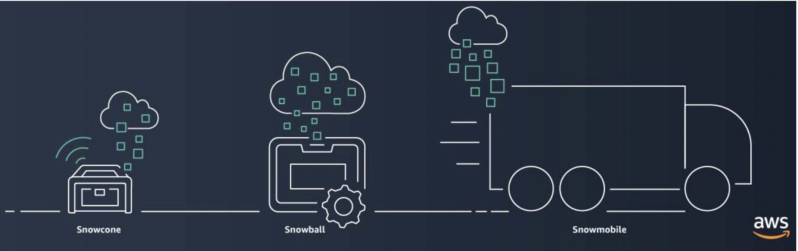

## Cloud Adoption Framework

Six core perspectives of the Cloud Adoption Framework

- At the highest level, the AWS Cloud Adoption Framework (AWS CAF) organizes guidance into six areas of focus, called Perspectives. Each Perspective addresses distinct responsibilities. The planning process helps the right people across the organization prepare for the changes ahead.

- In general, the *Business*, *People*, and *Governance* Perspectives focus on business capabilities, whereas the *Platform*, *Security*, and *Operations* Perspectives focus on technical capabilities.

- The Business Perspective helps you to move from a model that separates business and IT strategies into a business model that integrates IT strategy.
- The Operations Perspective focuses on operating and recovering IT workloads to meet the requirements of your business stakeholders.
- The People Perspective helps Human Resources (HR) employees prepare their teams for cloud adoption by updating organizational processes and staff skills to include cloud-based competencies
- The platform perspective helps you design, implement, and optimize your AWS infrastructure based on your business goals.
- The Governance Perspective helps you to identify and implement best practices for IT governance and support business processes with technology.

## Migration strategies

6 strategies for migration

When migrating applications to the cloud, six of the most common migration strategies that you can implement are:

- Rehosting: 
    * also known as “lift-and-shift” involves moving applications without changes. 

    * In the scenario of a large legacy migration, in which the company is looking to implement its migration and scale quickly to meet a business case, the majority of applications are rehosted.  

- Replatforming: 
    * also known as “lift, tinker, and shift,” involves making a few cloud optimizations to realize a tangible benefit. Optimization is achieved without changing the core architecture of the application.

- Refactoring/re-architecting: 
    * Refactoring (also known as re-architecting) involves reimagining how an application is architected and developed by using cloud-native features. Refactoring is driven by a strong business need to add features, scale, or performance that would otherwise be difficult to achieve in the application’s existing environment.

- Repurchasing: 
    * Repurchasing involves moving from a traditional license to a software-as-a-service model. 

    * For example, a business might choose to implement the repurchasing strategy by migrating from a customer relationship management (CRM) system to Salesforce.com.

- Retaining: 
    * consists of keeping applications that are critical for the business in the source environment. This might include applications that require major refactoring before they can be migrated, or, work that can be postponed until a later time.

- Retiring:
    * is the process of removing applications that are no longer needed.

## AWS Snow Family members

- The AWS Snow Family is a collection of physical devices that help to physically transport up to exabytes of data into and out of AWS. 

AWS Snow Family is composed of 

- AWS Snowcone:
    * AWS Snowcone is a small, rugged, and secure edge computing and data transfer device. 
    * It features 2 CPUs, 4 GB of memory, and 8 TB of usable storage.
    * can be sent back to AWS offline, or connect it to internet and use AWS DataSync to send data.
- AWS Snowball:
    * Snowball Edge Storage Optimized devices are well suited for large-scale data migrations and recurring transfer workflows, in addition to local computing with higher capacity needs. 
    ** Storage: 80 TB of hard disk drive (HDD) capacity for block volumes and Amazon S3 compatible object storage, and 1 TB of SATA solid state drive (SSD) for block volumes. 
    ** Compute: 40 vCPUs, and 80 GiB of memory to support Amazon EC2 sbe1 instances (equivalent to C5).

    * Snowball Edge Compute Optimized provides powerful computing resources for use cases such as machine learning, full motion video analysis, analytics, and local computing stacks. 
        ** Storage: 42-TB usable HDD capacity for Amazon S3 compatible object storage or Amazon EBS compatible block volumes and 7.68 TB of usable NVMe SSD capacity for Amazon EBS compatible block volumes. 
        ** Compute: 52 vCPUs, 208 GiB of memory, and an optional NVIDIA Tesla V100 GPU. Devices run Amazon EC2 sbe-c and sbe-g instances, which are equivalent to C5, M5a, G3, and P3 instances.
        Compute: 40 vCPUs, and 80 GiB of memory to support Amazon EC2 sbe1 instances (equivalent to C5).
- AWS Snowmobile
    * AWS Snowmobile is a service that is used for transferring up to 100 PB of data to AWS. Each Snowmobile is a 45-foot long shipping container that is pulled by a semi trailer truck.
    * better than snowbal if you transfer more than 10PB.
    

These devices offer different capacity points, and most include built-in computing capabilities. AWS owns and manages the Snow Family devices and integrates with AWS security, monitoring, storage management, and computing capabilities.  

## Innovative with AWS
- Serverless: 
* With AWS, serverless refers to applications that don’t require you to provision, maintain, or administer servers. You don’t need to worry about fault tolerance or availability. AWS handles these capabilities for you.

* AWS Lambda is an example of a service that you can use to run serverless applications. If you design your architecture to trigger Lambda functions to run your code, you can bypass the need to manage a fleet of servers.

* Building your architecture with serverless applications enables your developers to focus on their core product instead of managing and operating servers.

- Artificial intelligence
* AWS offers a variety of services powered by artificial intelligence (AI). 

* For example, you can perform the following tasks:

** Convert speech to text with Amazon Transcribe.
** Discover patterns in text with Amazon Comprehend.
** Identify potentially fraudulent online activities with Amazon Fraud Detector.
** Build voice and text chatbots with Amazon Lex.

- Amazon SageMaker
Traditional machine learning (ML) development is complex, expensive, time consuming, and error prone. AWS offers Amazon SageMaker to remove the difficult work from the process and empower you to build, train, and deploy ML models quickly.

You can use ML to analyze data, solve complex problems, and predict outcomes before they happen.